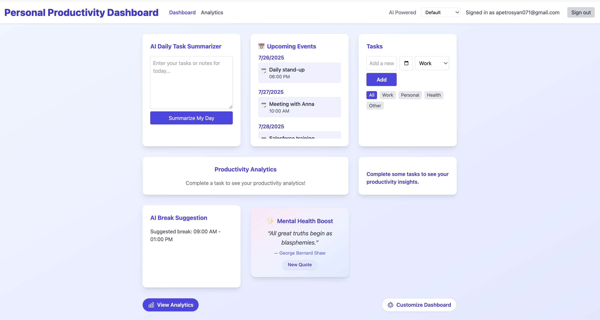
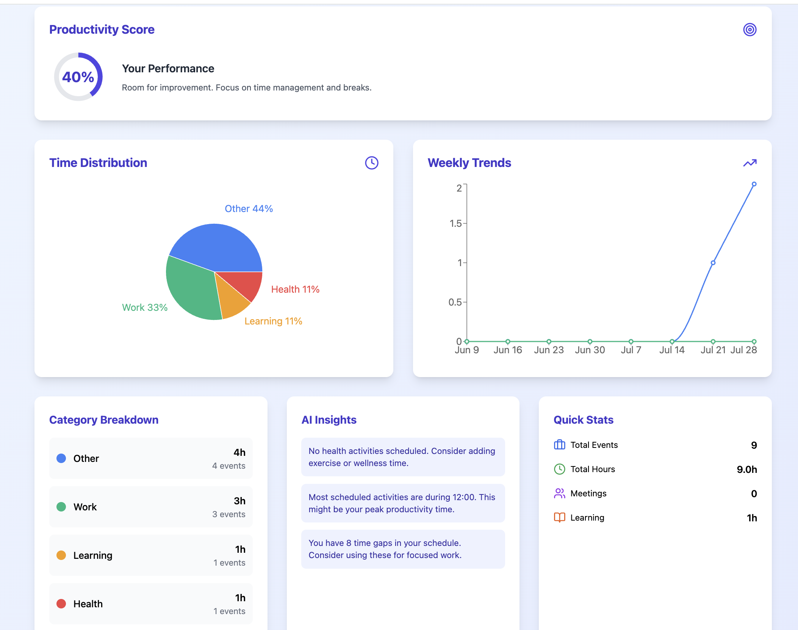
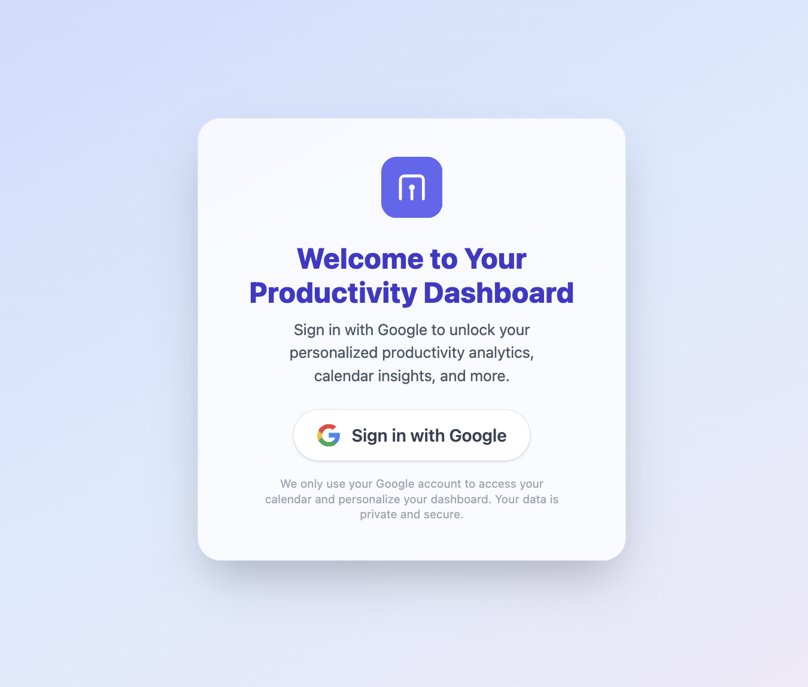

# Personal Productivity Dashboard

A modern, AI-powered productivity dashboard that integrates with Google Calendar to provide real-time insights, task management, and personalized analytics.

## Features

### **Core Productivity Tools**
- **Task Management**: Create, categorize, and track tasks with due dates and notes
- **AI Summarizer**: Get AI-powered summaries of your daily tasks and notes
- **Customizable Dashboard**: Show/hide widgets based on your preferences
- **Multiple Themes**: Choose from different visual themes (Default, Focus, Sunset, Ocean)
- **Motivational Quotes**: Daily inspiration to boost productivity

### **Google Calendar Integration**
- **Real-time Calendar Display**: View your upcoming events directly on the dashboard
- **Calendar Analytics**: Comprehensive analysis of how you spend your time
- **Time Distribution Analysis**: Visual breakdown of work, personal, health, and learning activities
- **Weekly Trends**: Track productivity patterns over time
- **AI Break Suggestions**: Smart recommendations for optimal break times
- **Schedule Gap Detection**: Find time periods for focused work

### **AI-Powered Insights**
- **Productivity Score**: Algorithm-based scoring (0-100%) based on your schedule
- **Smart Event Categorization**: Automatic categorization of calendar events
- **Work-Life Balance Analysis**: Insights on your schedule distribution
- **Meeting Analytics**: Track meeting frequency and duration
- **Personalized Recommendations**: AI suggestions based on your patterns

### **Advanced Analytics**
- **Time Distribution Charts**: See how you spend time across categories
- **Weekly/Monthly Reports**: Detailed productivity summaries
- **Goal Tracking**: Set and monitor productivity goals
- **Trend Analysis**: Compare productivity over different time periods
- **Real-time Data**: All analytics based on actual Google Calendar data

## Screenshots

### Dashboard Overview


### Analytics Page


### Sign-in Experience


## Technology Stack

- **Frontend**: Next.js 15.4.1, React 18.2.0, TypeScript
- **Styling**: Tailwind CSS, Lucide React Icons
- **Authentication**: NextAuth.js with Google OAuth
- **Charts**: Recharts for data visualization
- **Calendar**: Google Calendar API integration
- **Deployment**: Vercel-ready

## Quick Start

### Prerequisites
- Node.js 18+ 
- Google Cloud Platform account
- Google Calendar API enabled

### Installation

1. **Clone the repository**
   ```bash
   git clone https://github.com/AniPetrosyan/personal-productivity-dashboard.git
   cd personal-productivity-dashboard/client
   ```

2. **Install dependencies**
   ```bash
   npm install
   ```

3. **Set up Google OAuth**
   - Go to [Google Cloud Console](https://console.cloud.google.com/)
   - Create a new project or select existing one
   - Enable Google Calendar API
   - Create OAuth 2.0 credentials
   - Add `http://localhost:3000/api/auth/callback/google` to authorized redirect URIs

4. **Configure environment variables**
   Create `.env.local` in the client directory:
   ```env
   GOOGLE_CLIENT_ID=your_google_client_id.apps.googleusercontent.com
   GOOGLE_CLIENT_SECRET=your_google_client_secret
   NEXTAUTH_URL=http://localhost:3000
   NEXTAUTH_SECRET=your_generated_secret_key
   ```

5. **Generate NEXTAUTH_SECRET**
   ```bash
   node -e "console.log(require('crypto').randomBytes(32).toString('hex'))"
   ```

6. **Run the development server**
   ```bash
   npm run dev
   ```

7. **Open your browser**
   Navigate to [http://localhost:3000](http://localhost:3000)

## API Routes

- `/api/auth/[...nextauth]` - NextAuth.js configuration for Google OAuth
- `/api/calendar` - Google Calendar integration
- `/api/quotes` - Motivational quotes API
- `/api/summarize` - AI summarization (requires backend server)

## 🔧 Configuration

### Google Calendar Permissions
The app requests read-only access to your primary Google Calendar. Users can:
- View their calendar events
- Analyze time distribution
- Get productivity insights
- Revoke access anytime through Google Account settings

### Privacy & Security
- All calendar data is processed locally in your browser
- No calendar data is stored on our servers
- Users maintain full control over their data
- Read-only access to calendars

### Weekly Trends
- Track work vs personal hours over 8 weeks
- Productivity scoring
- Meeting frequency analysis
- Schedule optimization insights

### AI Insights
- Meeting overload detection
- Work-life balance analysis
- Schedule gap identification
- Productivity pattern recognition
- Personalized recommendations

---

*Transform your productivity with AI-powered insights and real-time calendar analytics.* 